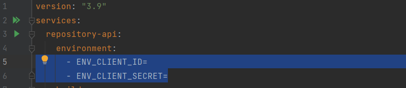

This is a web service which stream info about visible repositories for a specific user.

### Environment variables
**If** you **don't have a Github token**, you can ignore next paragraph, but in this case **Github API** can limit your attempts to request data.\
Before launch, please, ensure that your local environment has next variables:
* ENV_CLIENT_ID - client id for GitHub Authentication
* ENV_CLIENT_SECRET - client secret for Github Authentication

**If** you use docker container, please, provide these environment variables in docker-compose file (services:repository-api:environment) before start.\

### Docker launch
To launch the web application you can use Docker and perform the next command:
`docker-compose up -d`

To stop web application, perform please next command:
`docler-compose down`

To delete and rebuild image perform next commands:
1. `docker container rm $(docker container ls -a --filter="ancestor=com-repository-api:latest" -q)`
2. `docker image rm com-repository-api:latest`
3. `docker-compose up -d`

The following api mappings are available:
`/repositories/{username}` - list of repositories for a particular user with specified `username` in URL path. \
**Required**\
Path Variable: _username_ - name of user for which repositories must be retrieved \

###Swagger

Swagger is available via URIs: 
* /swagger
* /swagger-ui/index.html